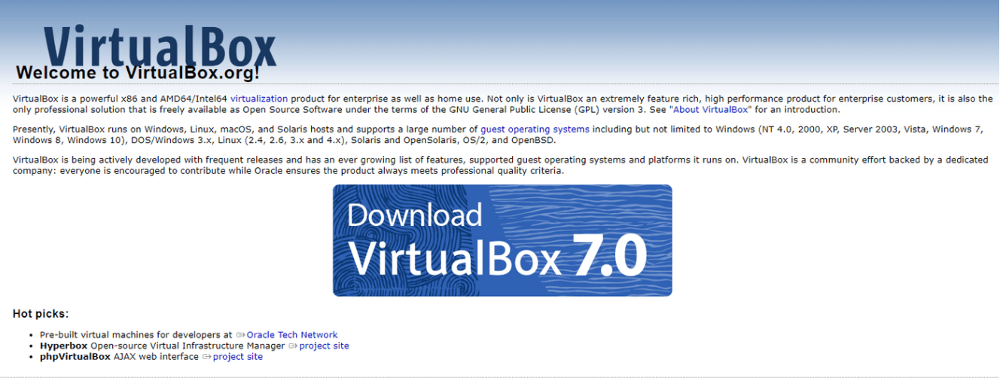
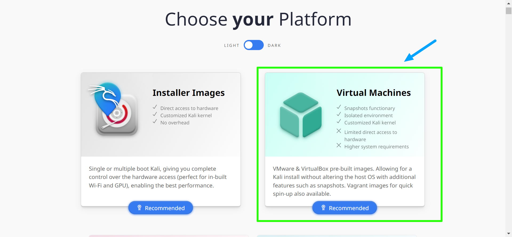
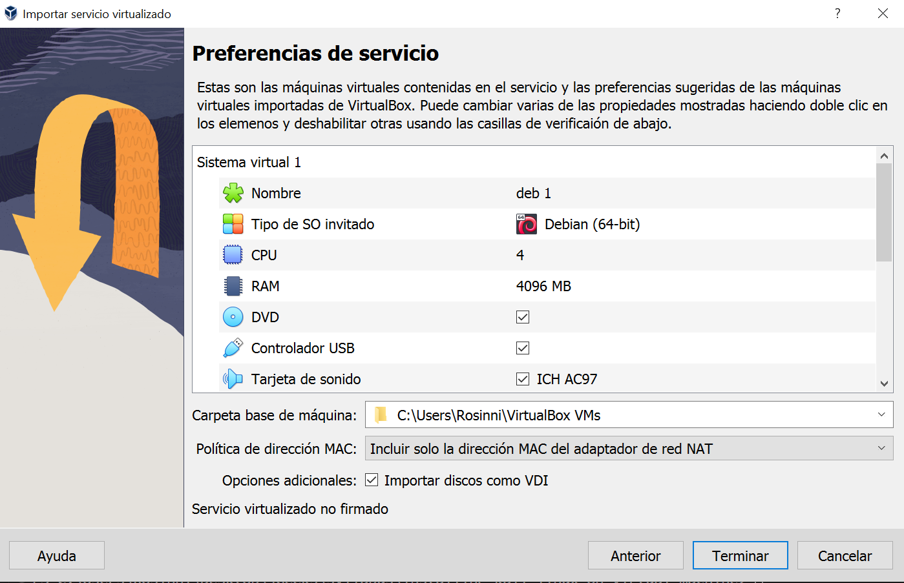

# Instalando Kali Linux en una máquina virtual


<!-- hide -->

> By [@rosinni](https://github.com/rosinni) and [other contributors](https://github.com/4GeeksAcademy/deploying-wordpress-debian/graphs/contributors) at [4Geeks Academy](https://4geeksacademy.co/)

[](https://4geeks.com)
[](https://twitter.com/4geeksacademy)

*These instructions are [available in english](https://github.com/breatheco-de/spoofing-and-DoS-lab/blob/main/README.md)*
<!-- endhide -->


<!-- hide -->


### Antes de empezar...

> ¡Te necesitamos! Estos ejercicios se crean y mantienen en colaboración con personas como tú. Si encuentras algún error o falta de ortografía, contribuye y/o repórtalo.

<!-- endhide -->

## 🌱 ¿Cómo empezar este proyecto?

¡No clones este repositorio! solo sigue las intrucciones.

Instalar Kali Linux en una máquina virtual es una excelente manera de explorar y utilizar esta poderosa herramienta de seguridad sin riesgo para tu sistema operativo principal. Este enfoque proporciona un entorno seguro y flexible que es ideal tanto para el aprendizaje como para aplicaciones profesionales. En esta práctica aprenderemos a instalar una.


### Requisitos

* Descargar VirtualBox desde  [Downloads](https://www.virtualbox.org/wiki/Downloads).
* Descargable desde Kali Linux [Downloads](https://www.kali.org/get-kali/#kali-platforms).

## 📝 Instrucciones

### Paso 1: Instalación de Virtualbox
VirtualBox es una herramienta de virtualización gratuita y de código abierto que permite a los usuarios ejecutar múltiples sistemas operativos simultáneamente en su computadora.

- [ ] Ejecuta el instalador descargado y sigue las instrucciones del asistente de instalación.
- [ ] Una vez instalado, abre VirtualBox.





### Paso 2: Descarga de máquina virtual kali linux:
* Descarga desde Kali Linux [Downloads](https://www.kali.org/get-kali/#kali-platforms). 
> 💡 NOTA: Podemos descargar una imagen ISO para instalación desde cero o una imagen preconfigurada para VirtualBox (OVA/VBOX). En esta práctica, vamos a usar la imagen VBOX.



- [ ] En la sección de imágenes para máquinas virtuales, selecciona la versión de VirtualBox y descarga el archivo VBOX (que generalmente viene como un archivo comprimido).


- [ ] Si el archivo VBOX está comprimido, descomprímelo utilizando una herramienta como 7-Zip, WinRAR o el descompresor nativo de tu sistema operativo.

### Paso 3: Creacion de la Máquina Virtual:
- [ ] Ve a la carpeta donde descomprimiste la descarga de kali linux y ejecuta el archivo `vbox` haciendo doble clic. Esto va iniciar tu maquina kali con todas las configuraciones listas: nombre de la maquina, tipo de sistema operativo, CPU etc.

> 💡 IMPORTANTE: Si haces esto con un archivo OVA deberás:

* Ir a la opción Archivo en virtualbox -> `Importar servicio virtualizado....`
* En la ventana que se abre, haz clic en Seleccionar `archivo de aplicación virtual...` y selecciona el archivo OVA de Kali Linux que descargaste.
* En la siguiente ventana, puedes revisar y ajustar la configuración de la máquina virtual (por ejemplo, asignación de memoria, número de CPUs, etc.). Se recomienda al menos 2 GB (2048 MB), pero 4 GB (4096 MB) o más sería ideal para un mejor rendimiento.





* Una vez que estés satisfecho con la configuración, haz clic en Importar/terminar.

### Paso 4: Iniciar la Máquina Virtual
- [ ] Selecciona la máquina virtual de Kali Linux y haz clic en Iniciar. La máquina virtual se iniciará y verás la pantalla de arranque de Kali Linux.
* Utiliza las credenciales predeterminadas para iniciar sesión:

```
Nombre de usuario: kali
Contraseña: kali
```

### Paso 5: Actualización del Sistema (recomendado):
Abre una terminal y ejecuta los siguientes comandos para actualizar el sistema:

```sh
sudo apt update
sudo apt upgrade -y
```


¡Listo!
Ahora puedes comenzar a usar Kali Linux en tu máquina virtual.

