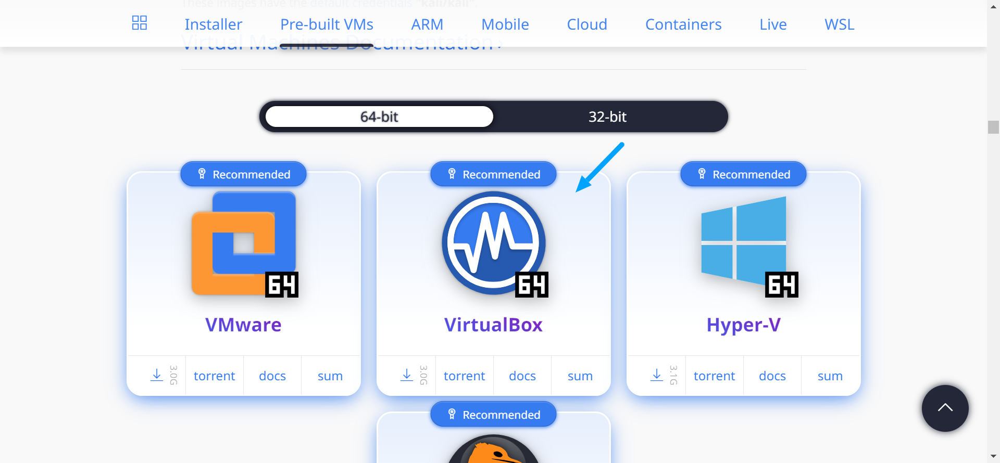

<!-- hide -->
# Installing kali linux on virtual machine

> By [@rosinni](https://github.com/rosinni) at [4Geeks Academy](https://4geeksacademy.co/)

[](https://4geeks.com)
[](https://twitter.com/4geeksacademy)

*Estas instrucciones están [disponibles en Español](https://github.com/breatheco-de/installing-kali-linux-on-virtual-machine/edit/main/README.md)*

### Before you start...

> We need you! These exercises are built and maintained in collaboration with contributors such as yourself. If you find any bugs or misspellings please contribute and/or report them.

<!-- endhide -->

## 🌱 How to start a project?

Do not clone any repository! Just follow instructions below:

Installing Kali Linux on a virtual machine is an excellent way to explore and use this powerful security tool without risking your main operating system. This approach provides a secure and flexible environment that is ideal for both learning and professional applications. In this practice, we will learn how to install one.

### Requirements
* Download VirtualBox from Downloads.
* Download Kali Linux from Kali Linux Downloads.

## 📝 Instructions


### Step 1: Installing VirtualBox
VirtualBox is a free and open-source virtualization tool that allows users to run multiple operating systems simultaneously on their computer.

 - [ ] Run the downloaded installer and follow the installation wizard instructions.
 - [ ] Once installed, open VirtualBox.

 


### Step 2: Downloading Kali Linux Virtual Machine
 - [ ] Download from Kali Linux Downloads.
> NOTE: You can download an ISO image for a fresh installation or a pre-configured image for VirtualBox (OVA/VBOX). In this practice, we'll use the VBOX image.


- [ ] In the virtual machines section, select the VirtualBox version and download the VBOX file (typically comes as a compressed file).


- [ ] If the VBOX file is compressed, unzip it using a tool like 7-Zip, WinRAR, or your OS's built-in decompressor.

### Step 3: Creating the Virtual Machine
 - [ ] Click on the "New" button in the VirtualBox main window.
 - [ ] Name the virtual machine (e.g., Kali Linux).
 - [ ] Select Linux as the operating system type and Debian (64-bit) as the version.
 Click "Next."
- [ ] Allocate the amount of RAM you want to assign to the VM. At least 2 GB (2048 MB) is recommended, but 4 GB (4096 MB) or more would be ideal for better performance.
- [ ] Click on Next.


 - [ ] In the hard disk section, select "Use an existing virtual hard disk file."
 Click on the folder icon next to this option and navigate to the uncompressed VBOX file.
 Select the VBOX file and click "Open" and create it.


### Step 4: Starting the Virtual Machine
- [ ] Select the Kali Linux virtual machine and click "Start." The VM will boot up, and you'll see the Kali Linux boot screen.
- [ ] Use the default credentials to log in:
     Username: kali
     Password: kali

### Step 5: System Update (Recommended)
Open a terminal and run the following commands to update the system:

```sh
sudo apt update
sudo apt upgrade -y
```

All Set!
Now you can start using Kali Linux on your virtual machine.
